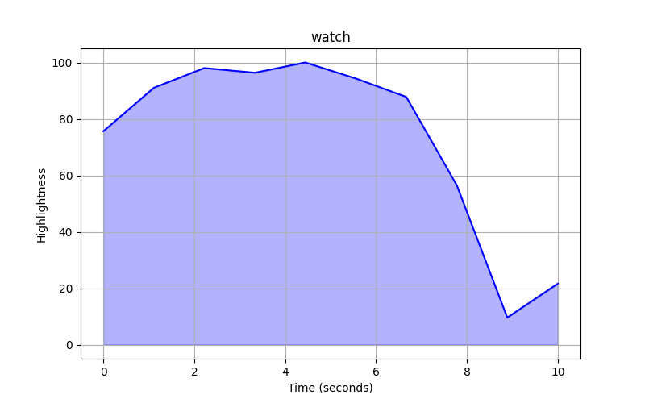

# Video Highlight Detection

### Unified Multi-modal Transformers
Prošel jsem různé články a přístupy, ale nakonec jsem se rozhodl jít cestou UML.
Koukal jsem, že tento přístup jste měli i v doporučených studiích.
Model je založen na získávání kontextu z video a audio části pomocí transformer architektury, následně pak tyto dva vstupy
kombinuje (dá se použít i text query pro MR, nicméně model funguje i bez toho pro HD) a dokáže vypíchnout highlight momenty.

- GitHub: https://github.com/tencentarc/umt?tab=readme-ov-file
- Studiue: https://arxiv.org/pdf/2203.12745

#### Postup:

- Rozparsování videa na segmenty (1-2s)
- Převod na optical flow a rgb složky - numpy pole (get_rgb_and_opt.py)
- Extrakce důležitých informací z těchto složek pomocí I3D modelu a vytvoření polí vhodných pro vstup do UML (create_features.py)
  
  - GitHub: https://github.com/google-deepmind/kinetics-i3d
  - Studie: https://arxiv.org/pdf/1705.07750

- Inference modelu UML 
  
  - Pro potřeby Highlight detection jsem zvolil předtrénované modely na datasetu Youtube Highlights, které jsou poskytnuty na Githubu
  - Tyto modely byly trénovány speciálně pouze pro Highlight detection bez textového query
  - Inference modelu
  - Jako výstup bylo vytaženo ohodnocení segmentů videa - Highlights
  - Pro integraci našeho datasetu bylo potřeba změnit hodně scriptů, tak jsem dávám jen snippet samotné třídy UML s metodou forward, celé to běží na NNcoru a je to dost spletité, tak snad to stačí
    ````python
    @MODELS.register()
    class UMT(nn.Module):

    def __init__(self,
                 video_enc=None,
                 audio_enc=None,
                 cross_enc=None,
                 query_gen=None,
                 query_dec=None,
                 pred_head=None):
        super(UMT, self).__init__()

        cnt = sum(e is None for e in (video_enc, audio_enc, cross_enc))
        assert not cnt % 2 and ((query_gen is None) == (query_dec is None))

        self.video_enc = build_model(video_enc)
        self.audio_enc = build_model(audio_enc)
        self.cross_enc = build_model(cross_enc)
        self.query_gen = build_model(query_gen)
        self.query_dec = build_model(query_dec)
        self.pred_head = build_model(pred_head, bundler='modulelist')

        self.apply(lambda m: xavier_init_(m)
                   if isinstance(m, nn.Linear) else None)

    def forward(self, data, mode):
        mask = torch.where(data['saliency'] >= 0, 1, 0)

        if self.video_enc is not None:
            d_emb = r_emb = v_emb = self.video_enc(data['video'], mask=mask)
        else:
            v_emb = data['video']

        if self.audio_enc is not None:
            d_emb = r_emb = a_emb = self.audio_enc(data['audio'], mask=mask)
        else:
            a_emb = data['audio']

        if self.cross_enc is not None:
            d_emb = r_emb = self.cross_enc(v_emb, a_emb, mask=mask)

        if self.query_gen is not None:
            q_emb = self.query_gen(r_emb, data.get('query'))
            d_emb = self.query_dec(q_emb, r_emb)

        output = dict(
            _avg_factor=mask.size(0), _out=dict(meta=data.get('meta')))

        for pred_head in self.pred_head:
            output = pred_head(d_emb, data, output, mode)

        saliency = output['_out']['saliency']
        saliency_np = saliency.cpu().numpy()
        np.savetxt("saliency.txt", saliency_np, fmt="%.6f")
        return output
    ````
    
#### Výsledky:

Pro jednotlivé videa jsem zkoušel všechny možné modely, jelikož je problém, že modely jsou  vždy trénovány jen na konkrétní část datasetu z Youtube highlights, nicméně i tak si myslím, že u některých videí momenty zvládl daný model zachytit. Modely nejsou nějak velké a určitě by stálo za to s nimi zkusit fine-tuning nebo dokonce trénování od začátku na odvětví festivalů/koncertů, myslím si, že pak by mohli dávat opravdu skvělé výsledky na dané videa. Taky by určitě stála za zvážení obměnění metody pro extrakci flow a rgb částí ze samotného videa a následně důležitých informací z těchto složek, která by také určitě mohla zvednout přesnost, nicméně to je určitě na delší výzkum.

Výseldky jsou zaznačené v grafech, kde osa y je normalizovaná na stupnici 0 - 100 pro samotný highlight v daný moment, na ose x je pak čas daného videa v sekundách.





### Další zajimavé směry

Hodně zajimavých směrů bohužel nemá open-source kód a hodně architektur je zaměřeno na použití textového vstupu, nicméně našel jsem ještě přísup nazvaný Cross-category Video Highlight Detection, který opět využívá kontext z transfomers a pak takzvaný Scorer model pro ohodnocení jedtlivých momentů videa. Je open-source, nicméně neposkytuje všechny předtrénované modely, ale určitě to může být také zajimavý směr.

- Github: https://github.com/ChrisAllenMing/Cross_Category_Video_Highlight
- Studie: https://arxiv.org/pdf/2108.11770


